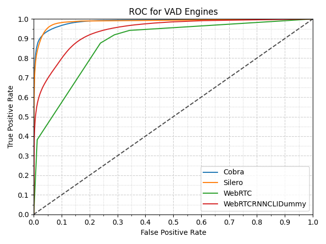

# Voice Activity Benchmark

[](https://github.com/Picovoice/voice-activity-benchmark/blob/master/LICENSE)

Made in Vancouver, Canada by [Picovoice](https://picovoice.ai)

The purpose of this benchmarking framework is to provide a scientific comparison between different voice activity
engines in terms of accuracy metrics. While working on [Cobra](https://github.com/Picovoice/Cobra)
we noted that there is a need for such a tool to empower customers to make data-driven decisions.


# Data

[LibriSpeech](http://www.openslr.org/12/) (test_clean portion) is used as the voice dataset.
It can be downloaded from [OpenSLR](http://www.openslr.org/resources/12/test-clean.tar.gz).

In order to simulate real-world situations, the data is mixed with noise (at 0dB SNR). For this purpose, we use
[DEMAND](https://asa.scitation.org/doi/abs/10.1121/1.4799597) dataset which has noise recording in 18 different
environments (e.g. kitchen, office, traffic, etc.). Recordings that contained distinct voice data is filtered out.
It can be downloaded from [Kaggle](https://www.kaggle.com/aanhari/demand-dataset).


# Voice Activity Engines

Two voice-activity engines are used:
[py-webrtcvad](https://github.com/wiseman/py-webrtcvad) (Python bindings to the WEBRTC VAD)
which can be installed using [PyPI](https://pypi.org/project/webrtcvad/).
And [Cobra](https://github.com/Picovoice/Cobra) which is included as submodules in this repository.


# Metric

We measured the accuracy of the voice activity engines using false positive and true positive rates.
The false positive rate is measured as the number of false positive frames detected over the total number of non-voice frames.
Likewise, true positive rate is measured as the number of true positive frames detected over the total number of voice-frames.
Using these definitions we plot a receiver operating characteristic curve which can be used to characterize performance differences between engines.


# Usage

### Prerequisites

The benchmark has been developed on Ubuntu 18.04 with Python 3.8. Clone the repository using

```bash
git clone --recurse-submodules git@github.com:Picovoice/voice-activity-benchmark.git
```

Make sure the Python packages in the [requirements.txt](/requirements.txt) are properly installed for your Python
version as Python bindings are used for running the engines.


### Running the Benchmark

Usage information can be retrieved via

```bash
python benchmark.py -h
```

The benchmark can be run using the following command from the root of the repository

```bash
python benchmark.py --librispeech_dataset_path ${LIBRISPEECH_DATASET_PATH} --demand_dataset_path ${DEMAND_DATASET_PATH} --access_key ${COBRA_ACCESS_KEY}
```

The runtime benchmark is contained in the [runtime](/runtime) folder. Use the following commands to build and run the runtime bechmark:
```bash
git clone --recursive https://github.com/Picovoice/cobra.git runtime/cobra
cmake -S runtime -B runtime/build && cmake --build runtime/build
./runtime/build/cobra_runtime -l {COBRA_LIBRARY_PATH} -a {ACCESS_KEY} -w {TEST_WAVFILE_PATH}
```

# Results

## Accuracy

Below is the result of running the benchmark framework. The plot below shows the receiver operating characteristic curve
of different engines. This plot was generated with the Signal-To-Noise ratio of 0dB.




## Runtime

On a Raspberry Pi Zero, Cobra measured a realtime factor of `0.05`, or about `5%` CPU usage.
On a laptop with a Intel(R) Core(TM) i7-1185G7, Cobra measured a realtime factor of `0.0006`.
